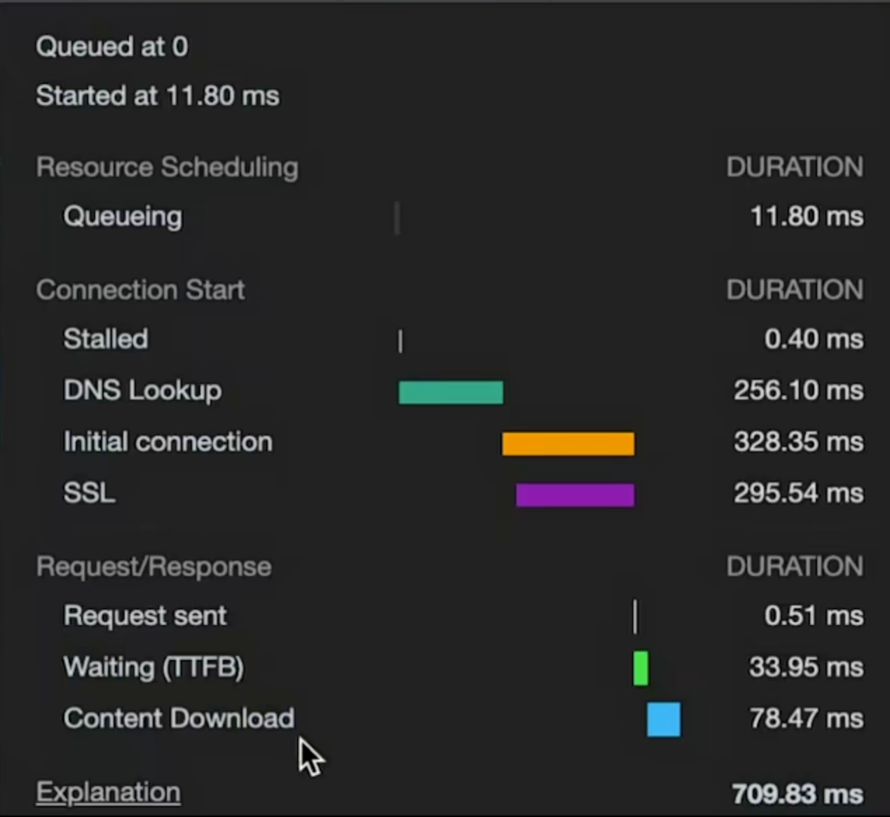

D_bug

Other
O1

# 前端性能优化指南

## 网页加载性能指标解析

上图展示了一个典型的网页加载性能指标面板，包含了以下关键信息：

| 指标 | 数值 | 含义 |
|------|------|------|
| 请求数量 | 118 requests | 页面加载过程中发起的HTTP请求总数 |
| 传输数据量 | 2.1 MB transferred | 网络传输的数据总量 |
| 资源大小 | 3.8 MB resources | 解压后的资源文件总大小 |
| 加载完成时间 | Finish: 16.65 s | 页面完全加载所需的总时间 |
| DOM内容加载时间 | DOMContentLoaded: 726 ms | DOM树构建完成的时间点，此时可以执行JavaScript操作DOM |
| 页面加载时间 | Load: 3.72 s | 页面及其所有资源加载完成的时间点 |

### 性能指标解读

1. **请求数量(118 requests)**：
   - 请求数量过多会增加网络开销和服务器压力
   - 优化策略：合并文件、使用sprite图、减少不必要的API调用

2. **传输数据量(2.1 MB) vs 资源大小(3.8 MB)**：
   - 传输数据量小于资源大小，说明使用了压缩技术
   - 优化策略：启用Gzip/Brotli压缩、使用WebP图片格式、代码压缩(minify)

3. **加载时间指标**：
   - **DOMContentLoaded(726 ms)**：较快，用户可以较早看到页面内容
   - **Load(3.72 s)**：在可接受范围，但仍有优化空间
   - **Finish(16.65 s)**：较长，可能有后台资源或异步请求延迟加载

### 优化建议

基于这些指标，可以考虑以下前端性能优化策略：

1. **减少请求数量**：
   - 使用打包工具(Webpack, Rollup等)合并JavaScript和CSS文件
   - 将小图标合并为sprite图或使用Icon Font/SVG
   - 实施合理的代码拆分策略，避免不必要的请求

2. **减小资源体积**：
   - 对图片进行适当压缩，使用现代格式(WebP, AVIF)
   - 移除未使用的CSS和JavaScript代码(Tree Shaking)
   - 使用CDN加载常用库，利用浏览器缓存

3. **优化渲染路径**：
   - 关键CSS内联，非关键CSS异步加载
   - 延迟加载非关键JavaScript
   - 优先加载可见区域内容(视口优先)

4. **提高感知性能**：
   - 实现骨架屏(Skeleton Screen)
   - 添加加载进度指示
   - 优化首次内容绘制(FCP)和最大内容绘制(LCP)

在本例中，DOMContentLoaded时间(726ms)相对较好，但总体完成时间(16.65s)过长，表明可能存在不必要的资源请求或后台处理，这些都是需要重点优化的区域。

## 性能监测工具

* Chrome DevTools Performance 面板
* Lighthouse
* WebPageTest
* PageSpeed Insights
* New Relic
* Datadog RUM

持续监测这些指标并与历史数据对比，能够帮助我们识别性能退化问题并及时修复。

如何插入同级目录的image.png

