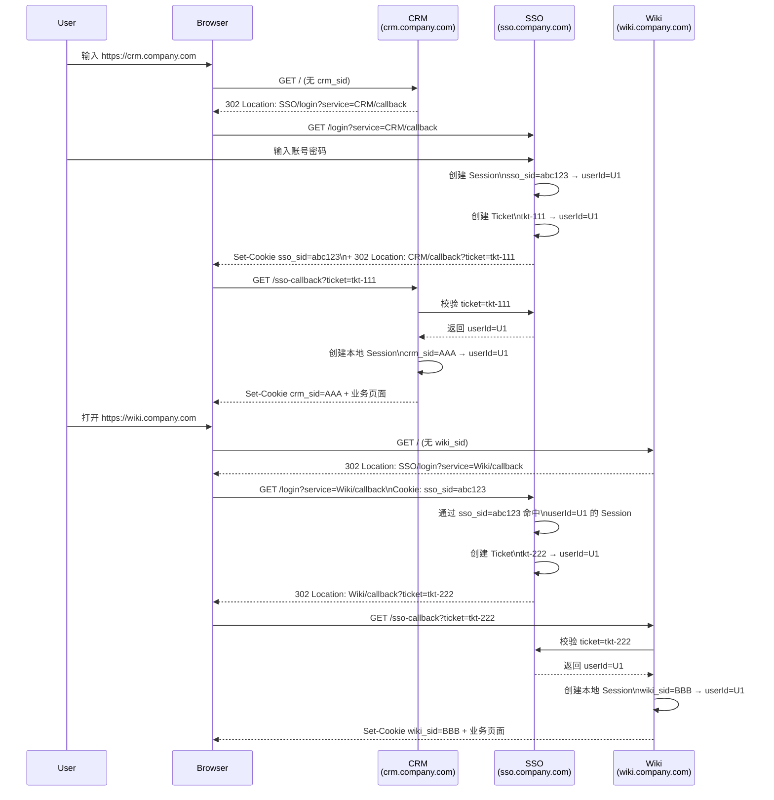

## 大厂常见单点登录（SSO）方案梳理

本文不讲特别底层的协议细节，重点总结「大厂里工程上常用、踩坑多」的几类单点登录方案和实现要点，方便设计和排查问题时快速对号入座。

---

## 1. 核心概念快速捋一遍

- **认证（Authentication）**：确认「你是谁」，常见是账号+密码 / 扫码 / 三方登录。
- **授权（Authorization）**：确认「你能干什么」，即权限体系（角色、租户、数据权限等）。
- **会话（Session）**：用户在一段时间内的登录状态，可以是：
  - 传统服务端 Session（SessionId + 服务端存储）
  - Token（JWT / 自研 Token）+ 服务端校验
- **单点登录（SSO）**：在统一认证中心登录一次后，可以无感访问多个系统，不需要重复登录。

大厂里几乎都会有一个「统一认证/帐号中心」，所有业务系统要么直接依赖它，要么通过网关/中间层间接依赖它。

---

## 2. 常见协议与标准

**为什么要知道协议？**  
很多大厂内部是自研协议 + 部分标准混用，理解标准协议可以帮助你看懂「改头换面」的内部实现。

- **SAML 2.0**
  - 传统大厂（偏 ToB、门户系统）常见，用 XML + 浏览器重定向/POST 传递断言。
  - 典型场景：企业门户统一登录，跳各个子系统。
  - 优点：成熟、生态多；缺点：XML 复杂、前端不友好。

- **OAuth 2.0 / OpenID Connect（OIDC）**
  - **OAuth 2.0 是什么？** 一个专门做「授权」的开放标准框架，它不关心你是怎么登录的，只关心：在用户同意的前提下，给第三方应用发一个「有边界的访问令牌（Access Token）」，让它可以代表用户去访问某些受保护资源（比如「读取你的日历」「访问你的企业通讯录」），而不需要把账号密码交出去。  
  - **OIDC 是什么？** OpenID Connect 是「长在 OAuth2 上的一层登录协议」，在 OAuth2 的授权流程里额外返回一个 `id_token`（通常是 JWT），里面标准化地描述了「你是谁」（如 `sub`、`name`、`email` 等），因此**既可以用来做登录（Authentication），又继承了 OAuth2 做授权（Authorization）的能力**。
  - 现在很多大厂新系统、对外开放平台都用这套。
  - OAuth 2.0 解决「授权」，OIDC 在其之上补上了「登录身份」。
  - 典型场景：移动 App / Web 前后端分离系统 / 三方登录（Google、GitHub、企业微信等）。
  - **可以先这样理解：**
    - OAuth2 里有三个主要角色：  
      - 用户（Resource Owner）  
      - 第三方应用（Client，比如一个接入了企业微信登录的内部系统）  
      - 授权服务器/资源服务器（Authorization Server/Resource Server，比如企业微信那边的登录 & 用户信息接口）  
    - 核心目标是：**让第三方应用在「用户同意」的前提下，拿到一个「有限能力的访问令牌（Access Token）」，而不直接拿到用户的账号密码。**
  - **最常用的一条线（授权码模式，简化版时序）：**
    1. 用户在第三方应用（比如 `app.company.com`）点击「使用企业微信登录」；
    2. 浏览器被重定向到企业微信的登录/授权页（授权服务器），用户在那边输入账号密码并同意授权；
    3. 授权服务器重定向回 `app.company.com` 的回调地址，并在 URL 上带一个一次性的 `code`（授权码）；
    4. 第三方应用的后端拿着这个 `code`，通过后端接口去找授权服务器换取 `access_token`（以及可选的 `id_token`、`refresh_token`）；
    5. 后端拿 `access_token` 去调用资源服务器的用户信息接口（/me），拿到 userId/头像/昵称等，再在自己系统里为这个用户创建/绑定账号和登录态。
  - **和前面讲的 Ticket 很像：**
    - 授权码 `code` ≈ 一次性 ticket，用来从授权服务器换真正的 Token，不长久保存；  
    - Access Token ≈ 可以被网关/后端长期携带的「访问令牌」，后续每次调用 API 时带在 Header 里；  
    - OIDC 在 OAuth2 之上，多了一个 `id_token`（通常是 JWT），专门用来表达「登录身份是谁」（sub、email 等），方便前端/后端快速获取用户信息。

- **CAS（Central Authentication Service）**
  - 一种比较经典的 Web SSO 协议，浏览器重定向 + Ticket 机制，大量老系统和高校系统在用。
  - 很多公司内部会基于 CAS 改造出自研版协议（URL 路由、参数名改一改，但核心思想类似）。

- **自研 Token / Ticket 协议**
  - 内部统一登录中心发一个 Token 或 Ticket，业务系统拿着它去「换本系统自己的登录态」。
  - 往往是「混合」：对外走 OAuth/OIDC，对内走自研。

---

## 3. 大厂常见 SSO 架构模式

### 3.1 同一顶级域下的「Cookie SSO」

**典型场景**：  
`passport.example.com`、`work.example.com`、`oa.example.com`

- 统一登录中心域名：`passport.example.com`
- 业务系统域名：`*.example.com`
- 做法：
  - 登录中心在根域名（`.example.com`）下写 Cookie（例如 `sid=abc123; Domain=.example.com`）。
  - 各个子系统收到请求时，自动带上这个 Cookie。
  - 子系统再用这个 `sid` 去统一会话服务验证，确认用户是谁。
  - **举个具体例子：**
    - 用户在 `passport.example.com/login` 成功登录后，响应头里返回：  
      `Set-Cookie: sid=abc123; Domain=.example.com; Path=/; HttpOnly`
    - 之后用户访问 `https://work.example.com/home` 或 `https://oa.example.com/list`，浏览器发现这些域名都属于 `.example.com`，于是自动在请求头里带上：  
      `Cookie: sid=abc123`
    - `work.example.com` / `oa.example.com` 的后端拿到 `sid=abc123` 后，到统一会话服务里查询「这个 sid 对应的是哪个 userId、租户、权限等」，从而实现「登录一次，多个子系统都认同」。

**优点**：
- 实现简单，浏览器自动带 Cookie。

**缺点**：
- 只适用于「同一顶级域名」；多顶级域（如 `.cn` 与 `.com`）就不行。
- Cookie 本身的安全问题（CSRF、XSS 泄漏、跨域），需要 SameSite/Secure 等配合。

---

### 3.2 多域名/多站点的「重定向 + Ticket」模式（类 CAS）

**典型场景**：  
`a.company.com`、`b.company.cn`、`c.another.com` 等系统之间单点。

**核心思路**：
1. 用户访问系统 A（未登录） → A 发现没有登录态 → 302 跳转到统一登录中心 `sso.company.com`，带上 `service=a.company.com/callback`。
2. 用户在登录中心完成登录，建立登录中心自己的 Session。
3. 登录中心 302 回系统 A 的 `callback`，URL 上带一个一次性的 `ticket=xxx`。
4. 系统 A 后端拿 `ticket` 去登录中心验证 → 成功后在 A 内部建立自己的 Session / Token。
5. 后续访问系统 B 时，重复「跳登录中心」的过程，但因为用户已经在登录中心登录，就只做第 3~4 步（不再弹登录页），最终达到 SSO。

> **为什么访问系统 B 还要再「跳登录中心」？**  
> - 因为「是否已经登录」这件事，是由登录中心自己记录在 `sso.company.com` 这个域下的 Cookie / Session 里的；  
> - 系统 B 自己无法直接读取这个 Cookie，它只知道「当前请求有没有自己这边的 Session」，并不知道「用户是否在统一登录中心登录过」；  
> - 通过重定向到登录中心，让浏览器把登录中心域名下的 Cookie 自动带过去，登录中心才能判断「这个人已经登录了」，然后再给系统 B 签发一个只对 B 有效的一次性 `ticket`；  
> - 所以「重复跳登录中心」不是为了让用户重复登录，而是为了让登录中心有机会「出具一张新场馆（系统 B）认可的门票」，从而在多系统之间安全地复用同一次登录。

**配合一个具体例子看会更清楚：**

- 设定三个系统：
  - 统一登录中心：`https://sso.company.com`
  - 系统 A：`https://crm.company.com`
  - 系统 B：`https://wiki.company.com`

1. **第一次访问系统 A**
   - 你直接在浏览器输入 `https://crm.company.com`；  
   - A 发现「自己这里没有 Session」，就返回一个 **HTTP 302 响应（由后端发起）**，响应头里带上 `Location`：  
     `https://sso.company.com/login?service=https%3A%2F%2Fcrm.company.com%2Fsso-callback`；
   - 浏览器此时访问的是 `sso.company.com`，登录成功后，登录中心给你种一个自己的 Cookie：  
     `Set-Cookie: sso_sid=abc123; Domain=sso.company.com; Path=/; HttpOnly`；
   - 然后再 302 回 A 的回调地址：  
     `https://crm.company.com/sso-callback?ticket=tkt-111`；
   - A 后端拿着 `tkt-111` 去问登录中心：「这个 ticket 是谁的？」→ 登录中心在内部维护了一张表（例如 `tkt-111 → userId=U1`，通常也会关联到 `sso_sid=abc123` 的 Session），所以可以直接查出 userId=U1 → 返回校验通过；  
   - A 在自己这里生成 `crm_sid=AAA`，以后访问 CRM 时就只认 `crm_sid`。

> **这里为什么既要有一次性的 `ticket=tkt-111`，又要有系统自己的 `crm_sid=AAA`？能不能不用 ticket，或者不用本地 Session？**
> - 可以把这两者想成「一次性入场券」和「本馆会员卡」：
>   - `ticket` 是登录中心签发给 CRM 的**一次性入场券**，只在这一次回调里用来证明「刚才登录成功的是谁」，用完就作废；  
>   - `crm_sid` 是 CRM 自己的**本地会员卡**，后面所有业务请求都只带它，既避免每个接口都去找登录中心，又方便 CRM 自己在 Session 里挂载各种本地状态。
> - 如果只有 `ticket` 没有本地 Session：  
>   - 要么每次请求都带着 `ticket` 去找登录中心「查身份」，登录中心会变成所有业务流量的单点瓶颈；  
>   - 要么把 `ticket` 当长期凭证用，而它是裸露在 URL 里的，一旦被日志、Referer、监控系统采集，就容易被重放攻击。
> - 如果只有 `crm_sid` 没有 ticket：  
>   - CRM 就不知道「这个 `crm_sid` 是谁授予的」，等于自己也在做一套登录流程，跟统一登录中心脱节，其他系统就没法信任这套登录结果；  
>   - ticket 的作用就是把「认证这一步」牢牢掌握在统一登录中心手里，再把结果通过一次性凭证、安全地交给各个业务系统。

2. **第一次访问系统 B**
   - 过一会儿你又打开 `https://wiki.company.com`；  
   - B 发现「自己这里也没有 Session」，同样 302 到登录中心：  
     `https://sso.company.com/login?service=https%3A%2F%2Fwiki.company.com%2Fsso-callback`；
   - **关键点来了**：这次浏览器访问 `sso.company.com` 时，会自动带上刚才的 Cookie：  
     `Cookie: sso_sid=abc123`；  
   - 登录中心看到这个 Cookie，就知道「你之前已经在这里登录过 userId=U1」，所以**不会再让你输密码**，而是直接生成新的 `ticket=tkt-222`，302 回 B：  
     `https://wiki.company.com/sso-callback?ticket=tkt-222`；
   - B 拿着 `tkt-222` 去问登录中心：「这个 ticket 是谁的？」→ 登录中心同样根据自己的 Session 回答「是 U1」；  
   - B 在自己这里生成 `wiki_sid=BBB`，以后访问 Wiki 就只看 `wiki_sid`。

> 这个例子里，「第二次跳到 `sso.company.com`」的作用其实只有一个：  
> 让浏览器顺带把 `sso_sid=abc123` 带过去，好让登录中心确定「这是同一个已经登录过的用户」，然后给**另一个系统（B）**再签一张新票。  
> 如果不跳这一趟，系统 B 既看不到登录中心的 Cookie，又不想直接信任系统 A 的 Cookie，只能让用户重新登录，达不到真正意义上的 SSO。

> **结合整个访问流程再看一眼 `sso_sid=abc123` 和 `tkt-111` 是怎么关联起来的：**
> - 第一次跳到 `sso.company.com/login` 时，浏览器还没有任何 SSO 的 Cookie，用户在这个页面上输入账号密码；  
> - 登录中心校验通过后，在自己的内存/Redis 里创建一条 Session 记录：  
>   `sso_sid=abc123  →  { userId=U1, 登录时间... }`，并通过 `Set-Cookie` 把 `sso_sid=abc123` 发给浏览器；  
> - 同时它再生成一个一次性的票据 `tkt-111`，在另一张表里记录：  
>   `tkt-111  →  userId=U1（或间接指向上面的 sso_sid=abc123 那条 Session）`；  
> - 之后浏览器带着 `ticket=tkt-111` 回到 CRM，CRM 的后端调用登录中心的「校验接口」：  
>   登录中心拿到 `tkt-111`，在自己的表里一查，就能知道这是 userId=U1，于是返回「通过」并附带用户信息；  
> - 后面当你从 CRM 再跳去 Wiki 时，浏览器访问 `sso.company.com` 会自动带上 `sso_sid=abc123` 这个 Cookie，  
>   登录中心看到这个 Cookie，就知道你已经有那条 `sso_sid=abc123 → userId=U1` 的 Session，于是**可以直接再生成一个新的 `tkt-222`，重复上面的「票据→用户」流程给 Wiki 用**。

> **看起来“多此一举”的那一跳：为什么认证中心明明知道 ticket 给了谁，还要让业务方再拿着 ticket 回头来问它？**
> 可以从「信任关系」和「网络方向」两个角度看：
> - **1）谁来信谁？前端发来的东西一律“不算数”，必须让后端跟后端直接对话**  
>   - 浏览器这一条链路是「不可信前端通道」：URL、表单、脚本都可以被用户或中间人篡改；  
>   - 认证中心把 `ticket=tkt-222` 写进 302 的 `Location` 里，只是说「我准备给 Wiki 一张票」，但**真正能决定是否接受这张票的，是 Wiki 自己的后端**；  
>   - 所以 Wiki 要自己拿着 ticket 用「后端对后端」的安全通道（内网、带鉴权的 API）去问认证中心：「这张票是不是你签的？是给我的？还没过期/没被撤销？」——这个确认动作不能省。
> - **2）认证中心不知道“这一票要落在哪个具体实例/机房”，只能让浏览器先把请求送到业务方**  
>   - 在大厂里，一个业务方（比如 Wiki）通常是多实例、多机房挂在负载均衡后面，认证中心没法也不应该直接去连这些后端实例；  
>   - 由浏览器先访问 `wiki.company.com`，交给网关/负载均衡去选具体实例，再由「这个实例」向认证中心校验 ticket，更符合实际的部署模型。
> - **3）安全上也需要“前后两跳”来完整闭环**  
>   - 第一跳（302 + ticket 放在 URL 上）解决的是「把认证结果从 SSO 安全地送到浏览器，再送到业务方」；  
>   - 第二跳（业务方后端拿 ticket 去校验）解决的是「业务方只信自己发起的、可审计的后端调用」，避免前端伪造 ticket 或重放旧的 URL；  
>   - 如果认证中心直接给 Wiki 发一条「你那边给我把 U1 登录一下」的消息，中间一旦出错/丢包/重试，很难和用户当前看到的浏览器请求对齐，工程上会非常难排查。
> 总结一下：**ticket 是“前端通道里能看见的凭证”，真正的“拍板”和“建本地 Session”必须由业务方后端在和认证中心的后端对话之后再做，这就是为什么要有这看起来绕了一步的流程。**

> **顺带用一个综合例子，把「多机房 / 多 Region / 网关 / 负载均衡 / 金丝雀发布 / 流量镜像」这些名词串一下：**
> - 假设外面只有一个域名：`wiki.company.com`。  
>   但公司实际上在两个城市各有一个机房：  
>   - **北京机房（Region A）**：跑着 `wiki-a-1`、`wiki-a-2` 两个实例；  
>   - **上海机房（Region B）**：跑着 `wiki-b-1`、`wiki-b-2`、`wiki-b-3` 三个实例；  
>   机房（IDC）+ Region 的意思，就是物理/网络上真正部署的「一堆机器/容器」，不是你在浏览器里看到的那个单一域名。
> - 域名 `wiki.company.com` 解析到的是一个**网关 / 负载均衡**（Nginx / APISIX / Envoy 之类）：  
>   - 它根据就近、权重、健康检查等规则，把浏览器的请求分发到某个实例上，比如这次是 `wiki-b-2`；  
>   - 如果 `wiki-b-2` 挂了，网关会自动把后面的请求打到其它实例，这就是「重试 / 熔断 / 机房调度」做的事情。
> - **金丝雀发布 / 灰度** 可以理解成「先让一小部分流量试跑新版本」：  
>   - 比如你在上海机房新拉起了一个 `wiki-b-canary`（v2 版本），网关配置成「1% 的请求打到 canary，99% 继续走旧版本」；  
>   - 这样就算 v2 有 bug，只会影响到那 1% 被灰度的用户，观察没问题后再慢慢把流量从旧版本切到新版本。
> - **流量镜像** 则是「复制一份真实流量给另一个实例看，但不影响用户真正的响应」：  
>   - 例如所有请求真实还是由 `wiki-b-2` 处理并返回结果，  
>   - 同时网关把这份请求「镜像」一份给隐藏在后面的 `wiki-b-shadow`（实验版本），它只在后台记录日志/指标，不对用户返回任何东西，方便压测或新特性验证。
> - 在这一整套复杂的流量调度之上，**SSO 只关心两件事**：  
>   1. 谁是用户（userId / sso_sid / ticket）；  
>   2. 哪个「Service」（这里就是域名 `wiki.company.com`）拿着票来找它校验。  
>   至于「具体是 `wiki-a-1` 还是 `wiki-b-3` 来校验 ticket」、「是否是 canary 实例处理这次请求」、「流量有没有被镜像到 shadow 实例」，  
>   全部都是网关 / 负载均衡 / 服务发现这一层的工作，认证中心不需要也不应该感知。

> **顺手补一句：「网关 / 负载均衡」本质是什么？**
> - 从网络角度看：它是站在众多后端服务前面的一层「入口代理」，对外只有少数几个 IP/域名（如 `wiki.company.com`），对内知道所有实际实例（`wiki-a-1`、`wiki-b-2`...），负责**把一条条请求转发到具体后端**；  
> - 从工程角度看：它是一个「集中做横向能力」的地方，例如：
>   - 统一做 TLS 终止（HTTPS 解密）、限流、熔断、重试、日志、监控；  
>   - 按路由规则把不同路径分发给不同服务（`/api` 给后端，`/static` 给静态服务器）；  
>   - 挂各种插件：鉴权、A/B 实验、风控、埋点等等。  
> - 你可以简单把它理解成：**“所有请求先经过的大门口 + 收银台 + 分配员”**，而后面的实例只是一个个真正干活的「收银员/货架」，至于 SSO/认证中心，只要跟这个「大门口」配合好就行了，不需要关心后面有多少人。 

**配一张简单的时序图（Sequence Diagram），把整个流程串一下：**



**特点**：
- 基本不依赖 Cookie 域名，只要浏览器能访问统一登录中心即可。
- 各系统只需要实现「识别 ticket + 向登录中心校验」这一套逻辑。

---

### 3.3 前后端分离 + 网关/反向代理 SSO

**典型架构**：
- 前端：SPA（Vue/React），部署在静态域名或 CDN。
- 后端：一堆微服务。
- 中间：统一 API Gateway（网关）。

**常见做法**：
- 统一登录仍然由「认证中心」完成，但：
  - 网关负责校验所有请求的 Token（JWT / 自研 Token）。
  - 网关校验通过后，把用户信息注入到请求头/上下文，转发给后端服务。
  - 前端只跟网关交互，不直接和各服务打交道。

**配一个类似的例子：前端只认网关，网关帮你和所有后端 & 认证中心打交道**

- 假设有这些角色：
  - 认证中心：`https://sso.company.com`
  - 统一网关：`https://api.company.com`
  - 前端应用：`https://app.company.com`（Vue 单页应用，所有接口都打 `api.company.com`）
  - 后端微服务：`user-service`、`order-service`、`report-service`（都在内网，只对网关开放）

1. **前端登录拿 Token**
   - 用户在 `https://app.company.com` 上点“登录”，前端把用户跳到 `https://sso.company.com/login?...`；  
   - 登录中心校验通过，签发一个访问网关用的 Token（比如 `access_token=JWT-123`），前端把这个 Token 存在内存 / Cookie / LocalStorage 里。

2. **前端之后的所有接口，只打网关一个入口**
   - 比如前端要查用户信息，会发请求：  
     `GET https://api.company.com/user/profile`，并在 Header 里带上：  
     `Authorization: Bearer JWT-123`；  
   - 前端完全不知道背后有没有 `user-service`、`order-service`，甚至不知道它们在哪个机房，只认 `api.company.com` 这一家。

3. **网关收到请求，先做「认证 + 鉴权」，再路由给后端**
   - 网关拿到 `Authorization: Bearer JWT-123` 后：
     - 要么自己验证这个 JWT（对称/非对称加解密）；
     - 要么调用认证中心的「校验 Token」接口，确认这个 Token 还没过期、没被撤销，并得到 userId=U1、角色等信息；
   - 校验通过后，网关在内部请求上下文里加上一些头，比如：  
     `X-User-Id: U1`、`X-User-Roles: admin,editor`；
   - 然后根据路由规则把请求转发到对应服务，比如 `/user/**` 转到 `user-service`，`/order/**` 转到 `order-service`。

4. **后端服务只关心“我收到的请求里，有没有用户信息”**
   - `user-service` 收到的是一个「已经带好用户信息」的请求（例如 Header 里有 `X-User-Id: U1`），它不需要再跟认证中心直接对话，只要信任来自网关的这些头就行；  
   - 权限控制也可以只在网关做一层粗粒度（有无登录、角色是否匹配），服务内部做细粒度（是否有权操作这条记录）。

> 用一句话概括这一模式：  
> **前端眼里只有一个后端：网关（`api.company.com`）**；  
> **网关眼里有两个世界：一边是认证中心（验证 Token），一边是成百上千个微服务（根据用户信息和路由规则来分发请求）**。  
> 这样 SSO 只需给网关签发/校验 Token，业务服务可以专心写业务，而不用在每个服务里都嵌一套「直接对接认证中心」的逻辑。

**优点**：
- 业务服务不感知具体认证逻辑，统一由网关收敛。
- 安全策略（黑白名单、限流、IP 过滤）都可在网关集中管理。

---

### 3.5 「3.2 模式」和「3.3 模式」怎么区分？（用分点记忆）

可以直接这样记：

- **从浏览器视角看：**
  - 3.2：浏览器直接访问多个后端域名（`crm.company.com`、`wiki.company.com`、`oa.company.com`），谁没登录谁自己 302 去 SSO。  
  - 3.3：浏览器的接口只有一个入口（`api.company.com`），其它后端服务都藏在网关后面，前端根本不知道有多少服务。

- **从「凭证」形态看：**
  - 3.2：SSO 发一次性 `ticket` 给各个系统，每个系统再各自生成自己的 `xxx_sid`（本地 SessionId + Cookie）。  
  - 3.3：SSO 发一个 `access_token`（比如 JWT），前端后续所有请求都把这个 Token 带给网关，网关验证后再把用户信息转给后端。

- **从「谁直接对接认证中心」看：**
  - 3.2：每个业务系统（CRM、Wiki…）都要实现「校验 ticket」的逻辑，系统一多，这段代码就要重复很多遍。  
  - 3.3：只有网关直接和认证中心打交道，业务服务只相信来自网关注入的 `X-User-Id` 等头部，不需要了解 SSO 细节。

- **从适合的架构形态看：**
  - 3.2：更适合一堆传统多页面 Web 应用（各自渲染 HTML、各自有独立域名）的场景。  
  - 3.3：更适合同一个前端（SPA/App）后面挂一堆微服务的「前后端分离 + API 网关」架构。

- **一句话总结：**
  - 访问的是**很多系统域名互相跳来跳去**，就优先往 3.2 的思路想；  
  - 访问时**只打一个网关域名，后面都是 API 微服务**，就优先往 3.3 的思路想。 

### 3.4 多端协同：PC Web 扫码登录移动 App 账号

**典型场景**：  
PC 网页显示二维码 → 手机 App 扫码 → PC 自动登录。

**通用流程**：
1. PC 网页向登录中心请求一个 `login_token`，用于标识本次扫码登录会话，同时在页面上渲染二维码（二维码里包含该 token）。
2. 手机端（已经登录的 App）扫码 → 将 `login_token` + 自己的登录态信息（或签名）发给登录中心。
3. 登录中心校验手机端身份合法后，将这次扫码与 PC 的 `login_token` 绑定，并生成 PC 用户的登录态（Session/Token）。
4. PC 端通过轮询/WebSocket 等方式向登录中心查询 `login_token` 是否已确认，一旦确认，就下发 Cookie/Token 完成登录。

**注意点**：
- `login_token` 一定要有过期时间 + 一次性使用。
- PC 端与登录中心的通信通道（轮询 / WebSocket）要有 CSRF、防劫持设计。

---

## 6. 安全与工程实践要点（简版清单）

- **Cookie 安全**
  - 设置 `HttpOnly`、`Secure`、`SameSite`（根据跨域方案选择 Lax / None）。
  - 避免在前端 JS 中随意读取敏感 Cookie。

- **CSRF 防护**
  - 对关键操作使用 CSRF Token / 双重 Cookie 策略。
  - 对敏感接口只接受特定来源（Origin/Referer 检查）。

- **Token 存储**
  - 浏览器端尽量避免把长期 Token 放在 `localStorage`，优先短期 Cookie + 刷新 Token。
  - 移动端可加设备指纹/设备绑定。


---

## 7. 实战设计时的几个「决策问题」

设计一个公司级 SSO 方案时，通常要先回答这些问题：

1. **系统边界**：哪些系统必须互相单点？是否有外部三方系统要纳入？
2. **协议选择**：内部用自研 Token / CAS，还是直接上 OAuth2/OIDC？  
   - 是否有对外开放平台需求？  
   - 是否有多租户 / 多 IdP（企业 AD、企业微信、飞书）对接需求？
3. **域名与部署**：是否都是一个顶级域？是否有海外站点、不同地域机房？
4. **会话形态**：统一 Session + 子系统本地 Session，还是全 Token 化？  
5. **登出策略**：是否需要「一处退出，处处失效」？  
6. **多端体验**：PC / H5 / 小程序 / App 是否都要统一账号体系？是否需要扫码登录？

这些问题确定后，再反推用哪种架构模式 + 哪种协议，最后再落成具体的接口和代码实现。

**综合回答一遍，可以形成这样一套“心里有数”的蓝图：**

- **系统边界**  
  - 先画出公司内所有「对用户可见」的系统：员工门户、CRM、Wiki、报表系统、审批系统、对外开放平台等；  
  - 标记哪些必须「互相单点」（比如同一个员工在门户、CRM、Wiki 之间无感切换），哪些只是「偶尔跳转」甚至完全独立（比如供应商外部系统）。

- **协议选择**  
  - 对**内部 Web 系统、多域名老系统**，往往沿用或演进为「类 CAS」的重定向 + Ticket 模式（类似前面的 3.2）；  
  - 对**前后端分离、移动端、小程序、对外开放平台**，优先选 OAuth2/OIDC + Token（类似前面的 3.3），因为更适合 API + 多端接入；  
  - 很多大厂实际是「混合」：内部 CAS + 外部 OAuth2/OIDC，共用同一个用户目录。

- **域名与部署**  
  - 如果大部分系统在同一个主域名下（如 `*.company.com`），可以在某些场景下顺手用 Cookie SSO 做一层优化（3.1）；  
  - 有海外站点、多个 Region 时，要假设「后端实例会很多且经常变」，这时**强烈建议让网关/负载均衡承担所有流量调度工作**，认证中心只面向域名/Service 而不是具体机器。

- **会话形态**  
  - 一般不会「只选一个」，而是**统一 Token + 各系统本地 Session 混用**：  
    - 统一登录中心签发 Token（或 Ticket）；  
    - 网关/系统用它换取本系统自己的 Session（`crm_sid` / `wiki_sid` / 用户上下文缓存等）；  
  - 对更现代的系统，可以尽量「Token 化 + 轻量本地缓存」，简化会话存储压力。

- **登出策略**  
  - 统一登录中心提供「全局登出」能力：清理自己的 Session/Token，并通过消息队列/回调通知各系统清理本地 Session；  
  - 对纯 Token 架构，考虑 Token 黑名单 / 撤销列表，防止用户退出后旧 Token 还能继续用。

- **多端体验**  
  - 账号体系要尽量统一：同一个 userId 可以在 PC Web、H5、App、小程序上登录；  
  - 扫码登录（PC 扫手机）可以看成「手机端帮 PC 去 SSO 换票」的一种特殊流程（前面 3.4 已经讲过）。

**综合举一个更贴近日常的大厂例子：**

- 公司现状：
  - 老系统：员工门户（`portal.company.com`）、CRM（`crm.company.com`）、知识库 Wiki（`wiki.company.com`），都是传统服务端渲染 Web；  
  - 新系统：一个统一的前端应用 `app.company.com`，后面有一堆微服务，通过网关 `api.company.com` 暴露；  
  - 对外还有开放平台 `open.company.com`，需要支持三方应用授权访问。

- 设计一套 SSO：
  1. **统一认证中心**：  
     - 域名 `sso.company.com`，负责账号密码登录、扫码登录、短信登录等统一认证；  
     - 内部使用统一的用户目录，给内部系统发 Ticket/Token，给开放平台按 OAuth2/OIDC 发授权码和 Access Token。
  2. **老系统（Portal/CRM/Wiki）走「3.2 类 CAS 模式」**：  
     - 浏览器访问 `portal/crm/wiki` 时，根据是否有本系统 Session 来决定要不要 302 到 `sso.company.com`；  
     - 登录中心发一次性 `ticket`，各系统用 ticket 换取本地 SessionId（`portal_sid`、`crm_sid`、`wiki_sid`），细节和前面 CRM/Wiki 例子一致。
  3. **新前端 + 微服务走「3.3 网关 + Token 模式」**：  
     - `app.company.com` 前端在需要登录时把用户带到 `sso.company.com`，拿到 `access_token` 后存起来；  
     - 后续所有接口都打 `api.company.com`，在 Header 里带 `Authorization: Bearer access_token`；  
     - 网关验证 Token 后，把 `X-User-Id` 等信息注入转发请求，后端微服务不再各自对接认证中心。
  4. **开放平台对外走 OAuth2/OIDC 标准协议**：  
     - 三方应用通过 `open.company.com` 做授权码/客户端凭证等标准流程，底层仍然对接同一个认证中心，只是走对外暴露的协议规范。
  5. **登出与风控**：  
     - 在 `sso.company.com` 点「退出登录」，会：  
       - 清理 SSO 自己的 Session；  
       - 将相关 Token 加入黑名单；  
       - 通过 MQ/回调通知 Portal/CRM/Wiki 等系统清理本地 Session。  
     - 网关在校验 Token 时会同时检查黑名单，做到真正的一处退出、处处失效。

> 这样一套设计，基本把前面所有章节提到的概念（Cookie SSO、Ticket、Token、网关、多端扫码、单点登出等）串成了一个「公司级 SSO 的全景图」，以后你在遇到任何具体问题时，都可以先问自己：**它是卡在这张图的哪一块？** 然后再顺着那一块的细节去排查和设计。 

---

## 8. 后续可以补充的内容（TODO）

- 画几张典型的大厂 SSO 时序图（CAS、OAuth2 授权码模式、扫码登录）。


---

## 9. 补充问答：Cookie / Session 相关的几个常见疑惑

### 9.1 为什么「同域」请求浏览器才会自动带上 Cookie？

- **浏览器的安全模型规定了 Cookie 的「作用域」**：
  - 每个 Cookie 都绑定在一个 `Domain`（和 `Path`）上，例如：`Domain=.example.com`。
  - 浏览器只会在「请求目标域名是该 Domain 或其子域」时自动带上这个 Cookie。
  - 这样可以避免：
    - 把登录态无意义地带给与当前站点无关的第三方域名；
    - 不相关站点通过监听请求拿到你的登录 Cookie（隐私与安全问题）。
- 换句话说，这是**一种「按域名隔离状态」的机制**，是浏览器层面的安全 & 隐私设计，而不是后端业务自己约定出来的。

### 9.2 做域名优化后，静态资源是不是就带不上 Cookie 了？

- 如果你把静态资源放在「不带登录态的独立域名」下，例如：
  - 业务站点：`www.example.com`
  - 静态资源：`static.examplecdn.com`
  - 且 Cookie 的 `Domain` 设置为 `.example.com`，那**访问 `static.examplecdn.com` 的请求确实不会带上这个 Cookie**。
- 这本身就是前端性能优化的一个常见思路：
  - 静态资源通常不需要用户登录信息；
  - 不带 Cookie 可以减少请求头体积，CDN 缓存命中也更干净。
- 只有在这两种情况下，你才「必须」让静态资源带上 Cookie：
  - 静态资源本身是**与用户强绑定的个性化资源**（比如私有文件、用户头像原图等）；
  - 或者你在静态域名上也跑了一些需要认证的接口。
- 如果业务对静态资源没有认证需求，那么**「静态资源不带 Cookie」反而是更好的状态**。


### 9.3 为什么服务端是用 sessionId 查找用户信息，而不是用 userId？

先用一个更好记的类比：

- **安全角度：sessionId 像「临时通行证」，userId 像「永久身份证」**
  - sessionId：每次登录随机生成（例如 `s8f7d6g5`），退出登录/过期就失效，就算被黑客截获，也只是「一段时间内能用」；
  - userId：固定不变（例如 `10086`），通常还和姓名、手机号、邮箱等绑定，如果直接拿它做登录凭证，一旦泄露，相当于把「身份证号 + 通行证」全给别人了，风险直接拉满。
- **灵活角度：sessionId 方便「动态管控」，userId 太「死板」**
  - 用 sessionId：可以做「多设备登录管理」「强制下线」——比如手机登录后让 PC 下线，只需让某个 sessionId 失效即可，不影响这个 userId 绑定的所有业务数据；
  - 如果用 userId 做 key，就等于把用户本身和会话强绑定，你既不能轻易改 userId，又很难区分「这台设备的会话」和「那台设备的会话」。

---


## 11. 综合实战案例：WPS AI 侧边栏的请求改造

为了不让概念“太虚”，我们以一个真实的业务场景——**“在 WPS Web 端使用 AI 侧边栏”** 为例，还原从用户点击到请求发出的完整代码链路。

### 11.1 场景描述
用户在浏览器打开 Word 文档，点击右侧“WPS AI”按钮，AI 面板加载并向后端发送 `POST /api/ai/chat` 请求。

### 11.2 改造前的痛点
*   **旧链路**：请求直接发出去，浏览器自动带上 `cookie: wps_sid=...`。
*   **问题**：
    *   如果用户在一个 **第三方嵌入页面**（iframe）里打开文档，浏览器可能会因为“第三方 Cookie 限制”导致 `wps_sid` 带不上，AI 功能直接不可用。
    *   CSRF 风险：恶意网站构造一个表单提交到这个接口，浏览器也会傻傻地带上 Cookie。

### 11.3 改造后的完整链路（代码级还原）

我们看看前端各个层级是怎么配合的：

#### 第一层：业务发起请求（完全无感）
业务开发同学写代码时，完全不需要感知 KSOSID，照常写 `fetch`：

```typescript
// 业务层代码：kso-indep/packages/ai-access/src/api.ts
export const chatWithAI = async (message) => {
  // 业务只管发请求
  return fetch('/api/ai/chat', {
    method: 'POST',
    body: JSON.stringify({ msg: message })
  });
};
```


#### 第二层：中间件拦截（深度解析：为什么要有这三个“神仙判断”？）

这段代码看似简单，实际上每一行都是为了解决 **“历史包袱”** 和 **“多端环境”** 的坑。我们一行行拆开看：

```typescript
// 核心中间件逻辑还原
export function fetchKsoAccountMiddleware(next) {
  return async (url, options) => {
    
    // ---------------------------------------------------------
    // 【判断 1】业务“逃生通道” (Escape Hatch)
    // ---------------------------------------------------------
    // Q: 为什么要允许关闭？
    // A: 不是所有请求都需要签名。
    //    1. 比如请求的是 CDN 上的图片/JS (https://cdn.kdocs.cn/...)，CDN 根本不认你的 Token，带了反而可能因为 Header 太大被拒。
    //    2. 比如不需要登录的公开接口 (Public API)。
    //    3. 比如有些第三方统计请求 (Google Analytics)，人家只认自己的规则。
    if (options.disableKsosid) {
      return next(url, options); // 直接放行，不签名
    }

    try {
      const accSdk = await getKsoAccountSDK();

      // ---------------------------------------------------------
      // 【判断 2】环境兼容性地狱 (The "WPS Client" Check)
      // ---------------------------------------------------------
      // Q: 为什么是 window.Extention？
      // A: 这是 WPS PC 客户端 (Windows/Mac/Linux) 注入到浏览器里的一个特有全局对象。
      //    只要 window.Extention 存在，就说明代码正跑在“WPS 客户端”的壳子里，而不是普通浏览器。
      //
      // Q: 为什么要判断 accSdk.supportKsosid === false？
      // A: 为了兼容“旧版本客户端”。
      //    - 新版客户端：集成了新的 AccountSDK，支持 JS 层计算 Token，supportKsosid = true。
      //    - 旧版客户端：壳子太老，JS SDK 还没升级，或者 Native 层会自己在网络库底层拦截注入 Cookie/Token。
      //    如果强行在 JS 层算 Token，可能会和 Native 层冲突，或者因为缺少 Native 桥接能力而报错。
      //    所以，如果是端内且不支持，就“认怂”，降级回老逻辑（靠 Cookie 或 Native 拦截）。
      if ((window).Extention && accSdk.supportKsosid === false) {
        return next(url, options);
      }

      // ---------------------------------------------------------
      // 【判断 3】防重复/手动覆盖 (Idempotency)
      // ---------------------------------------------------------
      // Q: 什么叫“已经有 Token 了”？
      // A: 这种情况很常见：
      //    1. 【失败重试】：请求发出去超时了，axios-retry 插件自动重试。此时 config 对象是复用的，
      //       Header 里可能已经有了上一次生成的 Token。如果再次签名，既浪费性能（加密计算很贵），
      //       又可能导致 Token 时间戳变动，服务端防重放校验失败。
      //    2. 【手动调试】：开发人员在调试时，想强制传一个特定的 Token 测接口，手动写了 headers: {'X-Pop-Token': '123'}。
      //    3. 【特殊流程】：某些请求可能是从其他页面透传过来的配置。
      //
      //    所以，只要 Header 里已经有货了，就尊重现有的，不再重新签。
      if (!options.headers?.['X-Pop-Token']) {
        
        // === 核心动作：实时签名 ===
        // 绑定 Method 和 URL，生成 PoP Token
        const popToken = await accSdk.signPopToken(
          (options.method || 'GET').toUpperCase(), 
          url
        );

        if (popToken && popToken !== 'empty') {
          options.headers = {
            ...options.headers,
            'X-Pop-Token': popToken
          };
        }
      }
    } catch (e) {
      // 【兜底】：签名挂了，也得硬着头皮发请求，万一服务端对某些接口放宽了校验呢？不能前端自己先死。
      console.error('[KSOSID] 签名失败，降级发送', e);
    }

    return next(url, options);
  };
}
```

#### 第三层：最终发出的 HTTP 报文
经过改造，浏览器发出的请求头变成了这样：

```http
POST /api/ai/chat HTTP/1.1
Host: ai.wps.cn
Cookie: wps_sid=s8f7d... (浏览器还是会带，但在新架构下它只是“备胎”或用于兼容)
X-Pop-Token: eyJhbGciOiJIUzI1Ni... (新增的主角！绑定了 POST 和 /api/ai/chat)
Content-Type: application/json
...
```

### 11.4 这个例子的“含金量”在哪？

这个案例展示了 **“架构迁移”** 中前端的真实处境：

1.  **不是“切一刀”那么简单**：我们不能直接把 Cookie 丢掉，而是要实现 **Cookie + Token 并存** 的过渡态（代码里并没有删除 Cookie 的逻辑）。
2.  **环境地狱**：必须处理 `window.Extention` 这种端内环境，因为端内有自己的鉴权体系，前端瞎签名反而会冲突。
3.  **侵入性管理**：通过 `middleware` 模式，把复杂的判断收敛在底层。如果让每个业务方去写 `if (isPC && support) sign()`，代码早就没法维护了。

这就是为什么说 **KSOSID 改造** 是一个重大的前端架构工程，而不仅仅是“加个 Header”。

---

## 12. 进阶场景：Web 嵌入客户端（Hybrid）的认证内幕

你提到了“端内”、“CEF”、“window.Extension”，这属于 **Hybrid 开发（混合开发）** 的范畴。在大厂里，Web 页面经常跑在自家的 PC 客户端（如 WPS Office）或 App 里
，这时候认证机制会比纯浏览器环境更复杂。

### 12.1 运行环境：CEF 是什么？
*   **CEF (Chromium Embedded Framework)**：简单说，就是把 Chrome 浏览器的核心（Blink 渲染引擎 + V8 JS 引擎）剥离出来，做成一个可以嵌入到 C++/C# 程序里的控件。
*   **WPS PC 版**：大量界面（如稻壳商城、AI 侧边栏、云文档列表）本质上就是嵌入了 CEF 的 Web 页面。
*   **Webview**：移动端（iOS/Android）对应叫 WebView，原理类似。

### 12.2 核心疑问：为什么客户端登录了，Web 就不用登？

你在开发时会发现，用户在 WPS 客户端主程序里登录了账号，打开你的 Web 页面时，既没有跳登录页，前端代码里也没看到显式的 `login()` 调用，但请求就是能通。
这是因为实现了 **“端内鉴权状态同步”**，通常有两种流派：

#### 流派 A：Cookie 同步 (Cookie Sync) —— “甚至连代码都不用改”
*   **原理**：
    1.  客户端（Native 层）登录成功，拿到服务端的 Session Cookie。
    2.  客户端调用 CEF 提供的接口（如 `CefCookieManager::SetCookie`），强行把这些 Cookie 写入到 Webview 的 Cookie Jar 里，域名设置为 `.wps.cn`。
    3.  当你的 Web 页面加载时，浏览器内核发现“咦，这个域名下已经有 Cookie 了”，于是发请求自动带上。
*   **特点**：前端**完全无感**，代码和在普通浏览器里运行一模一样。但缺点是 Cookie 容易丢，且受限于域名（跨域就废了）。

#### 流派 B：网络拦截与注入 (Network Interception) —— “客户端当代理”
*   **原理**：
    1.  客户端利用 CEF 的能力（`CefRequestHandler`），**拦截**了 Webview 发出的所有网络请求。
    2.  前端发请求时：`GET /api/user`（Header 是空的）。
    3.  客户端在底层拦截住这个请求，**偷偷补上** `Authorization: Bearer <Token>` 或 Cookie。
    4.  客户端把补全后的请求真正发给服务器。
*   **特点**：前端觉得自己没带 Token，但服务器收到了 Token。这解释了“**为什么我们这边不需要认证**”。

#### 流派 C：JSBridge 主动获取 (The KSOSID Way) —— “前端主动要”
*   **原理**：也就是 KSOSID 改造后的模式。
    1.  客户端在 `window` 对象上挂载一个 **Bridge 对象**（如 `window.Extention`）。
    2.  前端代码（Account SDK）显式调用 `window.Extention.getSign()`。
    3.  客户端 C++ 代码收到调用，计算好 Token，返回给 JS。
    4.  前端 JS 把 Token 塞进 Header 发请求。
*   **特点**：最安全，也是现在的趋势。前端明确知道自己在用什么身份发请求。

### 12.3 前端必须要懂的“端内交互”知识点

在处理这种 Hybrid 认证时，前端面试/实战中常考以下几点：

1.  **环境判断 (UserAgent & Object Detection)**
    *   **查户口**：怎么知道自己跑在 WPS 端内还是 Chrome 浏览器？
    *   **看 UA**：检查 `navigator.userAgent` 是否包含 `WPSOffice`、`KDocs` 等特定字符串。
    *   **看对象**：检查是否存在 `window.Extention` (WPS PC 特有) 或 `window.webkit.messageHandlers` (iOS)。
    *   *代码示例*：
        ```javascript
        const isWPSClient = !!window.Extention || /WPSOffice/i.test(navigator.userAgent);
        ```

2.  **JSBridge 通信原理**
    *   **JS 调 Native**：通常是 Native 往 window 注入一个函数，JS 调用这个函数传参（JSON 字符串），Native 拦截这个调用。
    *   **Native 调 JS**：Native 直接执行一段 JS 代码字符串，如 `webview.executeJavaScript("window.onNativeCallback(...)")`。

3.  **版本兼容性 (The Version Hell)**
    *   **痛点**：Web 页面是实时更新的，但用户的客户端可能是 3 年前安装的 WPS 2019，根本没有 `signPopToken` 这个方法。
    *   **对策**：必须做 **功能检测 (Feature Detection)**。
        ```javascript
        // 悲观策略：如果端能力不够，就降级
        if (window.Extention && !window.Extention.someNewFeature) {
           // 降级：不传 Token，赌 Native 会自动拦截注入 Cookie
           // 或者：提示用户“您的客户端版本过低，请升级”
        }
        ```

4.  **Cookie 隔离 (Cookie Isolation)**
    *   **坑**：有时候客户端登录了，但 Webview 里没状态。
    *   **原因**：CEF 的 Cookie 存储路径可能和系统的 IE/Chrome 不同步；或者客户端忘记做“Cookie 同步”操作。
    *   **调试**：在端内打开 `vconsole` 或 调试器（`http://localhost:9888`），手动打 `document.cookie` 看看有没有货。

通过理解这些，你就明白了为什么代码里会有那么多 `if (window.Extention)` —— 那是在和看不见的客户端环境“斗智斗勇”。

